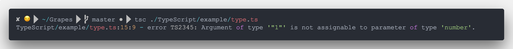

# 静态语言和动态语言
#### *静态语言又称静态类型语言，在声明时指定类型，一旦指定很难被修改，并在编译时检查类型；动态语言又称动态类型语言，在运行时根据上下文确定类型，可被多次赋予不同数据类型的值，固然在运行时检查数据类型。--[详情](https://blog.csdn.net/suchang1127/article/details/49299527)*
* ### 举个常见的栗子
    ```JavaScript
        /**
         * js代码
         */
        let a
        let add = (a, b) => {
                return a + b
            }
        a = add(1, 2)
        console.log(a)
        a = add('1', 2)
        console.log(a)
        /**
         * 输出 分别为 3 和 12
         */
    ```
    ```TypeScript
        /**
         * ts代码
         */
        let a: number 
        let add = ( a: number, b: number ): number =>{
            return a + b
        }
        a = add(1, 2)
        console.log(a)
        /* error */
        a = add('1', 2)
        console.log(a)
    ```
    
#### 代码逻辑较为简单时，还能做个自我分析。当大量逻辑堆叠，业务较为复杂时，就很难保证静态语言的准确性。把弱类型当优点允许参与各种运算，将会埋下难以预测的BUG。方法返回类型的校验，能大大提高代码的鲁棒性和可重构性，动态语言一时爽，代码重构火葬场！